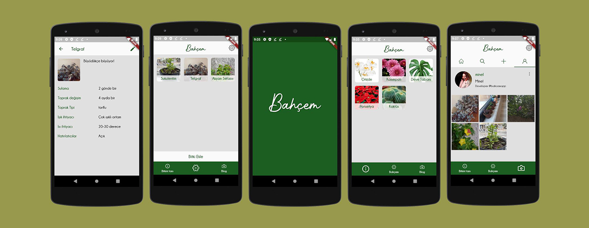

# Bahcem

A platform where you can get information about plants, follow your own plants, and share your plants on your own blog.

It was written with a team of three, using **Flutter** and **Firebase**.

## Developers:
* Minel SAYGISEVER - https://github.com/minelsaygisever
* Esra POLAT - https://github.com/esra-polat
* Nur Deniz ÇAYLI - https://github.com/nurdenizcayli
